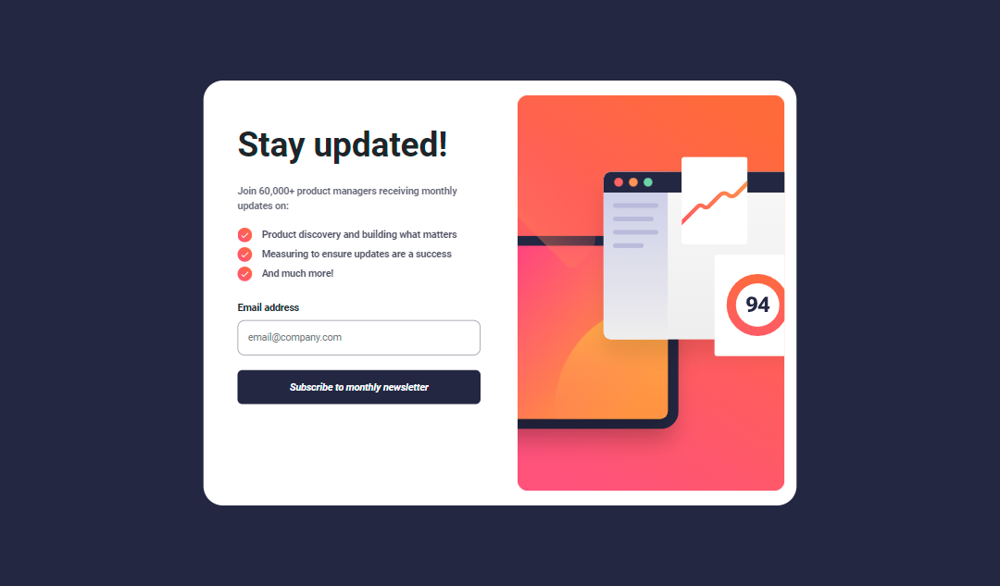
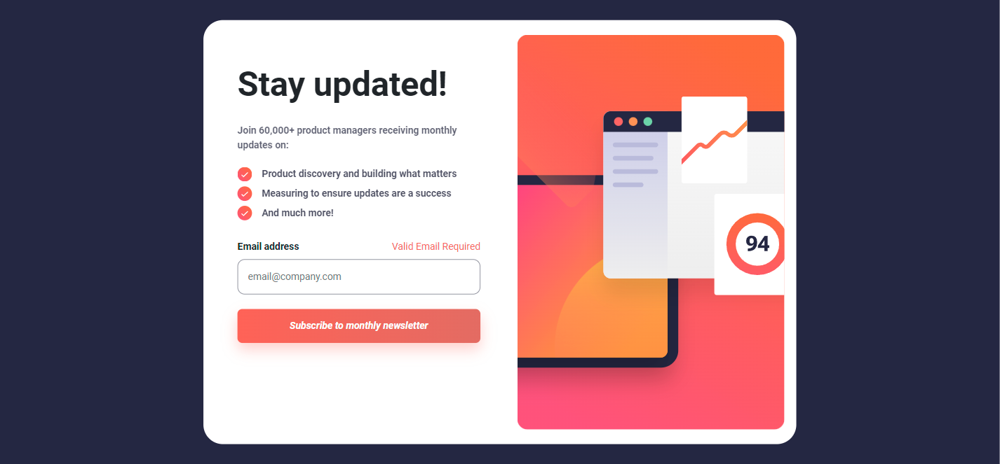
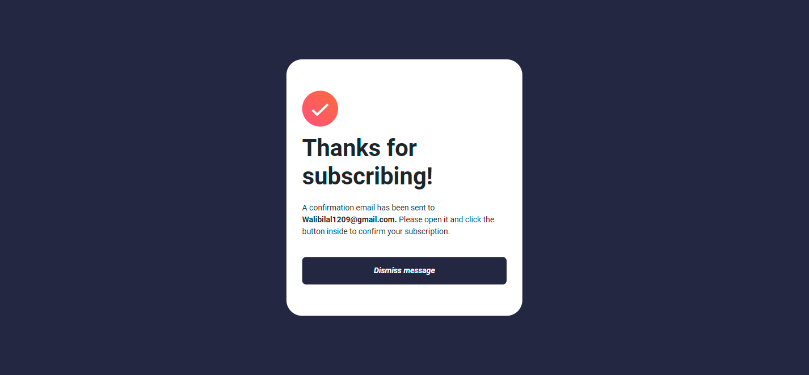
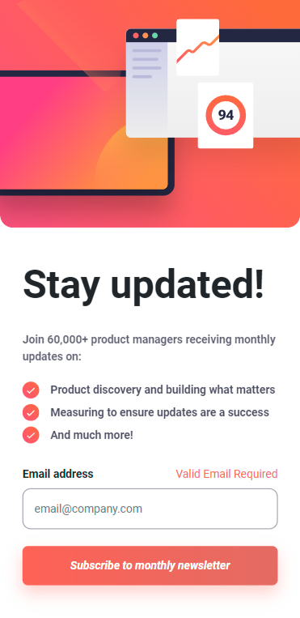
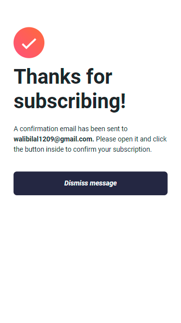

# Frontend Mentor - Newsletter sign-up form with success message solution

This is a solution to the [Newsletter sign-up form with success message challenge on Frontend Mentor](https://www.frontendmentor.io/challenges/newsletter-signup-form-with-success-message-3FC1AZbNrv). Frontend Mentor challenges help you improve your coding skills by building realistic projects.

## Table of contents

- [Overview](#overview)
  - [The challenge](#the-challenge)
  - [Screenshot](#screenshot)
  - [Links](#links)
- [My process](#my-process)
  - [Built with](#built-with)
  - [What I learned](#what-i-learned)
- [Author](#author)

## Overview

[Sun , Oct 1 23]
Ihis is the Frontend Mentor Newsletter signUp form It took me about 3Hours to complete this challenge

### The challenge

Users should be able to:

- Add their email and submit the form
- See a success message with their email after successfully submitting the form
- See form validation messages if:
  - The field is left empty
  - The email address is not formatted correctly
- View the optimal layout for the interface depending on their device's screen size
- See hover and focus states for all interactive elements on the page

### Screenshot

### Links

- Solution URL: [GitHub](https://github.com/Wali1209/newsletter-signup)
- Live Site URL: [gh-pages](https://wali1209.github.io/newsletter-signup/)

## My process

- Creating empty React project with Vite
- Installing dependencies with NPM
- Making Sturcture ready using BootStrap layout Classes
- Add styling
- Make it responsive
- Add animations(animation on scroll. aos)
- Build the project using npm run build
- push local Repo to the remote

### Built with

- Semantic HTML5 markup
- CSS custom properties
- Flexbox
- BootStrap 5
- Mobile-first workflow
- [React](https://reactjs.org/) - JS library

### What I learned

- Learn how to Add animation on scroll in React using aos library

## Author

- Frontend Mentor - [@Wali1209](https://www.frontendmentor.io/profile/Wali1209)
- GitHUB - [@Wali1209](https://github.com/Wali1209)
- Facebook - [Wali Hashmi](https://www.facebook.com/mdwali.hashmi.1/)
- Twitter - [@MWali1209](https://twitter.com/MWali1209)
- LinkedIn - [Md Wali](https://www.linkedin.com/in/md-wali-154461189/)
